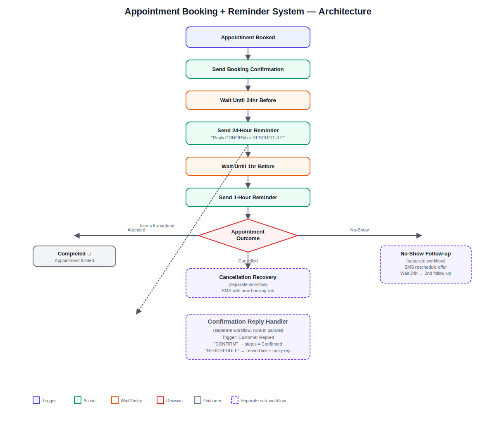

# Appointment Booking + Reminder System — GoHighLevel + n8n Automation

> Built by [Sohag Gain](https://bd.linkedin.com/in/sohaggain) — GoHighLevel Automation Specialist & Founder, [AI Smart Galaxy](https://aismartgalaxy.com)

## 🎯 The Problem

No-shows are one of the most expensive silent problems for clinics, coaches, salons, and consultants. Every missed appointment is lost revenue and wasted time slots that could have gone to another client — and most businesses only send one confirmation email, if that.

## 💡 The Solution

I built a complete **Appointment Booking + Reminder System** in GoHighLevel, orchestrated with n8n, that manages the full lifecycle of an appointment:

- Instant booking confirmation the moment a slot is reserved
- Automated 24-hour reminder with reply-to-confirm/reschedule logic
- Automated 1-hour reminder right before the appointment
- Smart handling of "CONFIRM" and "RESCHEDULE" replies via keyword detection
- No-show follow-up sequence to recover the lost slot
- Cancellation recovery flow to immediately re-offer the opened time slot

This turns a passive calendar into an active system that protects revenue and keeps calendars full.

## 🏗️ Architecture



**Flow summary:**
```
Appointment Booked
        ↓
Send Booking Confirmation
        ↓
Wait Until 24hr Before Appointment
        ↓
Send 24-Hour Reminder ("Reply CONFIRM or RESCHEDULE")
        ↓
Wait Until 1hr Before Appointment
        ↓
Send 1-Hour Reminder
        ↓
   Outcome ──Attended──→ Completed ✅
        │
        ├──Cancelled──→ Cancellation Recovery (sub-workflow): new booking link
        │
        └──No-Show──→ No-Show Follow-up (sub-workflow): reschedule offer → 24h → 2nd follow-up

[Parallel, listens throughout]
Confirmation Reply Handler: "CONFIRM" → status=Confirmed | "RESCHEDULE" → resend link + notify rep
```

## ⚙️ Tech Stack

- **GoHighLevel** — Calendars (Round Robin / Event), Availability settings, Workflows, Business Hours
- **n8n** — orchestration for reminder timing and reply-keyword branching
- **GHL LeadConnector API** — Appointments, Conversations/Messages, Contacts, Tags endpoints

## 🔑 Key Features

- **Two-touch reminder cadence** — 24-hour and 1-hour reminders, both with clear next-step instructions
- **Reply-driven logic** — clients can confirm or reschedule with a single text reply, no app or login needed
- **No-show recovery** — automatically re-engages no-shows instead of writing them off
- **Cancellation-to-rebooking loop** — the moment a slot opens up, the system tries to refill it
- **Fully configurable buffers** — minimum notice, slot duration, and buffer time all adjustable per business

## 📊 Results / Impact

- Designed to reduce no-show rates by **20-30%**, based on typical outcomes of multi-touch SMS reminder systems in appointment-based businesses
- Recovers previously-lost revenue from cancellations and no-shows through automatic re-engagement
- Removes front-desk staff time spent manually calling to confirm appointments

## 📁 Repository Contents

| File | Description |
|---|---|
| `appointment-reminder-workflow.json` | n8n workflow export — main reminder sequence + sub-workflow definitions (sanitized) |
| `appointment-reminder-architecture.svg` | Full architecture/flow diagram |
| `README.md` | This file |

## ⚠️ Note on Data

This is a portfolio demonstration built with dummy data. All credentials, phone numbers, account IDs, and client-identifying information have been removed or replaced with placeholders. The workflow logic and structure are production-representative.

## 🙋 About Me

I'm **Sohag Gain**, a GoHighLevel Automation Specialist and Founder of **AI Smart Galaxy** — an AI automation agency specializing in GoHighLevel, n8n, Make.com, Zapier, and AI agent development for businesses looking to scale their lead generation and client operations.

I build systems like this one for real businesses — fully customized to their exact workflow, tech stack, and goals.

- 🌐 Website: [aismartgalaxy.com](https://aismartgalaxy.com)
- 🛠️ Services: [aismartgalaxy.com/services-ai-automation](https://aismartgalaxy.com/services-ai-automation)
- 💼 LinkedIn: [bd.linkedin.com/in/sohaggain](https://bd.linkedin.com/in/sohaggain)

**Want a system like this built for your business?** Let's talk — I can have this customized and live for you in a matter of days.
